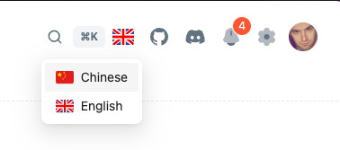

# 国际化

项目基于[react-i18next](https://react.i18next.com/)  来实现国际化，相关配置及组件放在src/locals目录下

```sh
├── src 
│   ├── locales 
│       ├── lang 
│           ├── en_US
│           ├── zh_CN
│       ├── i18n.ts
│       ├── useLocale.ts
```

## 配置国际化

```ts title='src/locales/i18n.ts'
import i18n from 'i18next';
import LanguageDetector from 'i18next-browser-languagedetector';
import { initReactI18next } from 'react-i18next';

import { getStringItem } from '@/utils/storage';

import en_US from './lang/en_US';
import zh_CN from './lang/zh_CN';

import { LocalEnum, StorageEnum } from '#/enum';

const defaultLng = getStringItem(StorageEnum.I18N) || (LocalEnum.en_US as string);
i18n
  // detect user language
  // learn more: https://github.com/i18next/i18next-browser-languageDetector
  .use(LanguageDetector)
  // pass the i18n instance to react-i18next.
  .use(initReactI18next)
  // init i18next
  // for all options read: https://www.i18next.com/overview/configuration-options
  .init({
    debug: true,
    lng: defaultLng, // localstorage -> i18nextLng: en_US
    fallbackLng: LocalEnum.en_US,
    interpolation: {
      escapeValue: false, // not needed for react as it escapes by default
    },
    resources: {
      en_US: { translation: en_US },
      zh_CN: { translation: zh_CN },
    },
  });

export default i18n;
export const { t } = i18n;
```

## useLocale
这是一个自定义 hook, 可以获取国际化相关信息
```ts
const {
  setLocale,
  locale,
  language: { icon, label },
} = useLocale();
```
其内部实现如下：
```ts title='src/locales/useLocale.ts'
import en_US from 'antd/locale/en_US';
import zh_CN from 'antd/locale/zh_CN';
import { useTranslation } from 'react-i18next';

import { LocalEnum } from '#/enum';
import type { Locale as AntdLocal } from 'antd/es/locale';

type Locale = keyof typeof LocalEnum;
type Language = {
  locale: keyof typeof LocalEnum;
  icon: string;
  label: string;
  antdLocal: AntdLocal;
};

export const LANGUAGE_MAP: Record<Locale, Language> = {
  [LocalEnum.zh_CN]: {
    locale: LocalEnum.zh_CN,
    label: 'Chinese',
    icon: 'ic-locale_zh_CN',
    antdLocal: zh_CN,
  },
  [LocalEnum.en_US]: {
    locale: LocalEnum.en_US,
    label: 'English',
    icon: 'ic-locale_en_US',
    antdLocal: en_US,
  },
};

export default function useLocale() {
  const { i18n } = useTranslation();

  /**
   * localstorage -> i18nextLng change
   */
  const setLocale = (locale: Locale) => {
    i18n.changeLanguage(locale);
  };

  const locale = (i18n.resolvedLanguage || LocalEnum.en_US) as Locale;

  const language = LANGUAGE_MAP[locale];

  return {
    locale,
    language,
    setLocale,
  };
}
```

## 新增内容
国际化语言文件放在了`src/locales/lang`目录下的`en_US`和`zh_CN`中, 新增内容时只需在相关`json`文件中新增字段就行。
```ts title='src/locales/lang/en_US/common.json'
{
  "common": {
    "okText": "OK",
    "closeText": "Close",
    "cancelText": "Cancel",
    "loadingText": "Loading...",
    "saveText": "Save",
    "delText": "Delete",
    "resetText": "Reset",
    "searchText": "Search",
    "queryText": "Search",

    "inputText": "Please enter",
    "chooseText": "Please choose",

    "redo": "Refresh",
    "back": "Back",

    "light": "Light",
    "dark": "Dark"
  }
}
```

## 使用

```ts title='组件外使用'
import { t } from '@/locales/i18n';

const errMsg = t('sys.api.errorMessage');
```

```tsx title='组件内使用'
import { useTranslation } from 'react-i18next';

const { t } = useTranslation();

<span>{t('sys.login.registerAndAgree')}</span>
```

## 切换语言

```ts
const { setLocale, locale } = useLocale();

const { setLocale} = useLocale();

setLocale(LocalEnum.en_US)
```



## 插件推荐
如果你使用vscode开发工具，推荐安装[I18n-ally](https://marketplace.visualstudio.com/items?itemName=Lokalise.i18n-ally)

