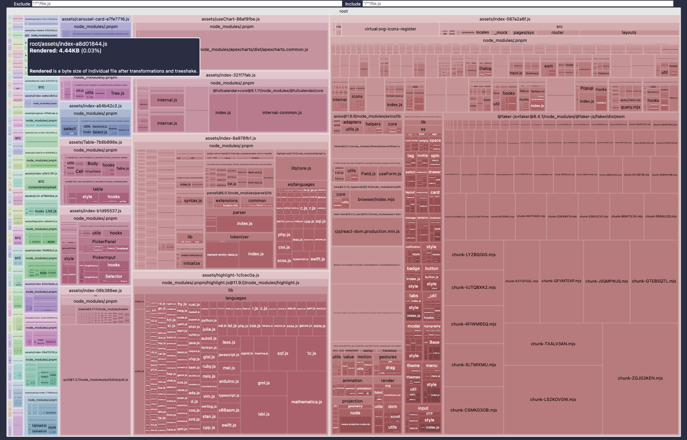

# 构建部署

## 构建
项目开发完成后，执行以下命令进行构建
```sh
pnpm build
```
构建打包成功之后，会在根目录生成 `dist` 文件夹，里面就是构建打包好的文件

### 预览
发布之前可以在本地进行预览，有多种方式，这里介绍两种
+  使用命令进行预览
```sh
# 先打包贼进行预览
pnpm preview
```

+ 本地服务器预览(通过http-server)
```sh
# 先全局安装 http-server
http-server ./dist
```

### 构建分析
项目使用 [rollup-plugin-visualizer](https://github.com/btd/rollup-plugin-visualizer)vite 插件进行构建分析，执行`pnpm build`后会在项目根目录下生成
`stats.html`文件，执行
```sh
http-server ./stats.html
```
就可以查看项目中各依赖库占用体积情况



## 部署
本项目为纯前端展示项目，适合部署为静态站点，比如：Github Pages 和 Vercel
:::tip 提示
Vite文档中有一章专门介绍如何 [部署静态站点](https://cn.vitejs.dev/guide/static-deploy.html)
:::