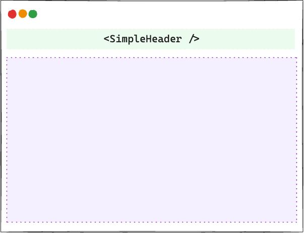
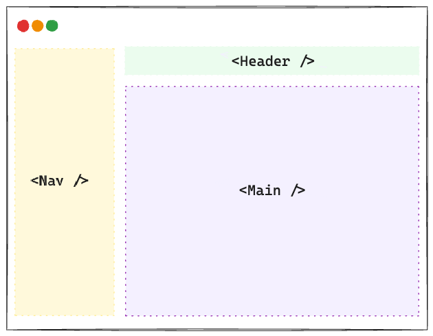
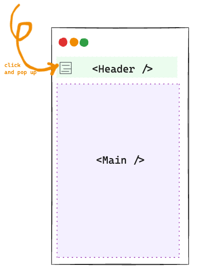

# 布局
布局相关组件放置在`src/layouts`目录下
```bash
├── src 
│   ├── layouts
│       ├── _common
│       ├── dashboard # dashboard layout
│       ├── simple # simple layout
```
项目内置了两种布局：
+ `<SimpleLayout />`
+ `<DashboardLayout />`


## SimpleLayout
这种布局结构简单，主要用于展示[404](https://admin.slashspaces.com/#/404)等异常页面




## DashboardLayout
这种布局结构较为复杂，包含多种变体。

### 垂直菜单


### 水平菜单


### 移动端
