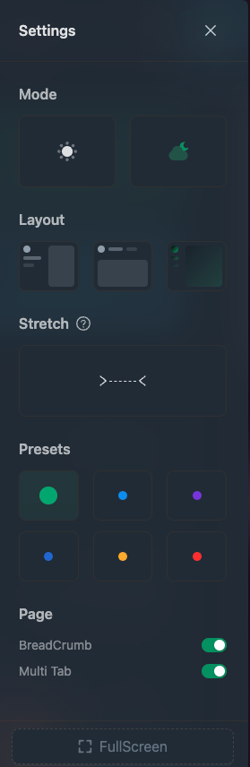

# 设置
项目内置了一些设置用于控制主题UI
+ Mode: 亮/暗 主题切换
+ Layout: 布局切换
+ Stretch: 宽度足够时是否撑开
+ Presets: 颜色预设
+ Page:
    + BreadCrumbs: 面包屑开关
    + Muti Tab: 多页签开关
+ FullScreen: 全屏



## settingStore
设置相关的功能都封装到SettingStore中了
```ts title='src/store/settingStore.ts'
import { create } from 'zustand';

import { getItem, removeItem, setItem } from '@/utils/storage';

import { StorageEnum, ThemeColorPresets, ThemeLayout, ThemeMode } from '#/enum';

type SettingsType = {
  themeColorPresets: ThemeColorPresets;
  themeMode: ThemeMode;
  themeLayout: ThemeLayout;
  themeStretch: boolean;
  breadCrumb: boolean;
  multiTab: boolean;
};
type SettingStore = {
  settings: SettingsType;
  // 使用 actions 命名空间来存放所有的 action
  actions: {
    setSettings: (settings: SettingsType) => void;
    clearSettings: () => void;
  };
};

const useSettingStore = create<SettingStore>((set) => ({
  settings: getItem<SettingsType>(StorageEnum.Settings) || {
    themeColorPresets: ThemeColorPresets.Default,
    themeMode: ThemeMode.Light,
    themeLayout: ThemeLayout.Vertical,
    themeStretch: false,
    breadCrumb: true,
    multiTab: true,
  },
  actions: {
    setSettings: (settings) => {
      set({ settings });
      setItem(StorageEnum.Settings, settings);
    },
    clearSettings() {
      removeItem(StorageEnum.Settings);
    },
  },
}));

export const useSettings = () => useSettingStore((state) => state.settings);
export const useSettingActions = () => useSettingStore((state) => state.actions);
```

## 类型定义
```ts title='types/enum.ts'
export enum ThemeMode {
  Light = 'light',
  Dark = 'dark',
}

export enum ThemeLayout {
  Vertical = 'vertical',
  Horizontal = 'horizontal',
  Mini = 'mini',
}

export enum ThemeColorPresets {
  Default = 'default',
  Cyan = 'cyan',
  Purple = 'purple',
  Blue = 'blue',
  Orange = 'orange',
  Red = 'red',
}
```